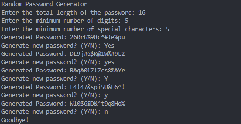

# Random Password Generator

I recently started learning Python and decided to create a simple password generator as a project. Inspired by BitWarden's built-in password generation feature, I wanted to build a similar tool from scratch.  

 

This script generates random passwords based on user-defined criteria. While it's a basic implementation at the moment, I plan to enhance and expand its features in the future. For now, it serves as a practical demonstration of my progress in Python.  

 

